<h1 align="center">WorkFlowOS</h1>

<h3 align="center">It watches how you work, finds what you keep repeating, and does it for you.</h3>

<b>AI-powered, OS-level workflow automation that earns your trust, heals itself when apps change, and can undo anything it did.</b>

  
  
  
  
  
  
  
  

<i>Built for the TechStackX Hackathon · CMRIT × 7thGear</i>

  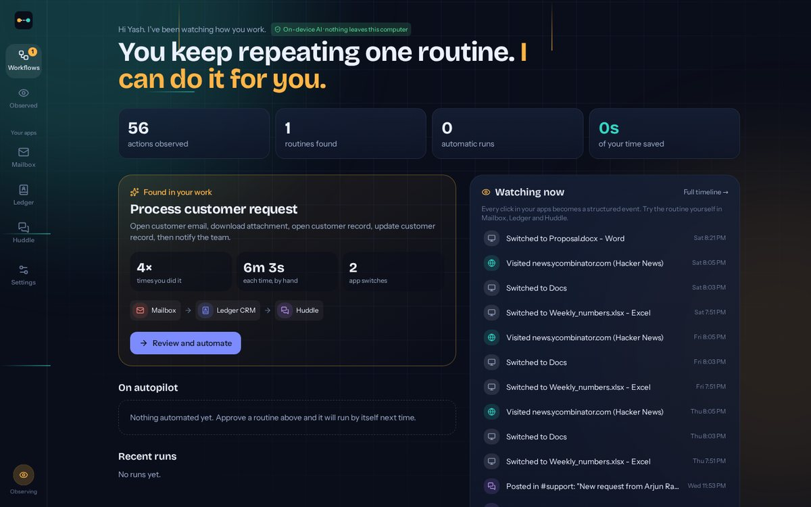

---

## 💡 The problem

> Users know how to do their work, but they should not have to know how to automate it.

A support person gets a customer email, downloads the attachment, finds the customer in the CRM, updates the record and pings the team. That's **6 minutes, 3 apps, 40 times a day: about 4 hours of copy-paste.**

Tools like Zapier or RPA make you design the automation yourself, and the recorded scripts break the day an app changes its screen.

## ✨ What WorkFlowOS does differently

| Feature | What it means for you |
| :--- | :--- |
| 🔍 **Finds routines by itself** | Watches your apps, browser and files, and spots the sequences you repeat. You never design anything. |
| 🧠 **Understands the intent** | Turns clicks into a named workflow ("Process customer request") with a trigger, steps, variables and conditions. |
| 🛡️ **Earns your trust** | New automations show you every change first. After clean runs it offers autopilot. |
| 🩹 **Heals itself** | When an app is redesigned ("Save" becomes "Update record"), it finds the new button by meaning and keeps going. |
| ↩️ **Undo anything** | Every run records how to reverse itself. One click rolls it all back. |
| 🗣️ **Change it by saying it** | "Only notify #finance for invoices and tag Priya" becomes a validated diff you approve. |
| 🔒 **Private by default** | The AI runs on your laptop through Ollama. Your activity never leaves the machine. |
| 🌐 **Works with real apps** | Real Gmail in, real Slack out, plus a desktop agent and a Chrome extension observing your actual computer. |

---

## 🔄 How it works

The full pipeline from the problem statement, end to end:

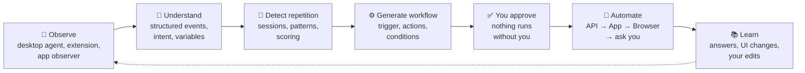

### 1 · Observe

Everything you do becomes a structured event: which app is in front, pages you visit, buttons you click, forms you submit, files you save, emails you open, records you update, messages you send.

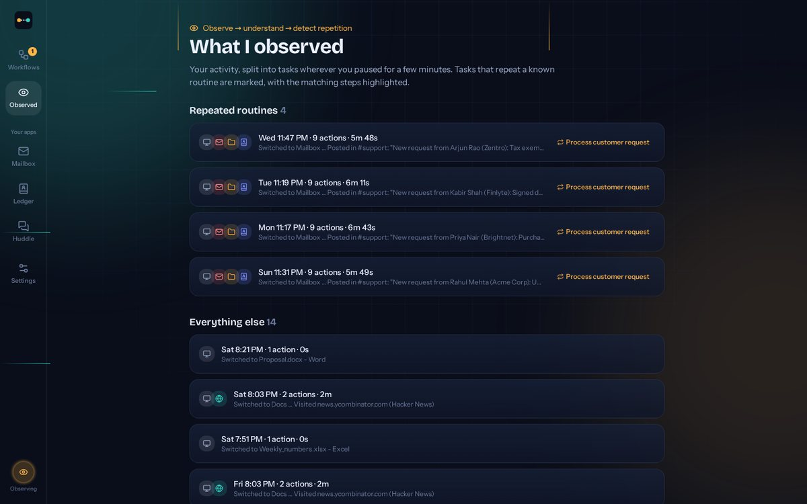

### 2 · Detect repetition

Activity is split into tasks wherever you pause for a few minutes. WorkFlowOS then looks for step sequences that come back across tasks, even with small detours in between. Each candidate is scored by **how often** it happens, **how long** it takes, **how many apps** it crosses, and **how many steps** it has. Two rules keep suggestions useful:

- Different ways of doing the same thing count as the same step: searching for a customer and clicking them in the list are both "find the customer".
- A routine must actually **do** something (save, send, download, submit). Just looking around is never suggested.

### 3 · Generate and approve

The routine becomes a readable workflow. It shows *why* it's suggested: how many times you did it, how long it took and how many app switches. It includes the rule the problem statement asks for: **if the customer can't be found, stop and ask**. It even learns the wording of your team message from what you typed, and turns it into a template.

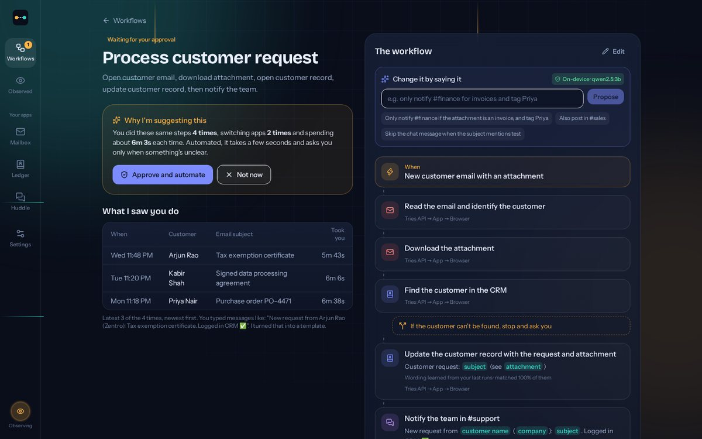

---

## 🤖 The automation engine

Every step tries the most reliable method first and falls back automatically. Each attempt is shown live, so nothing fails silently.

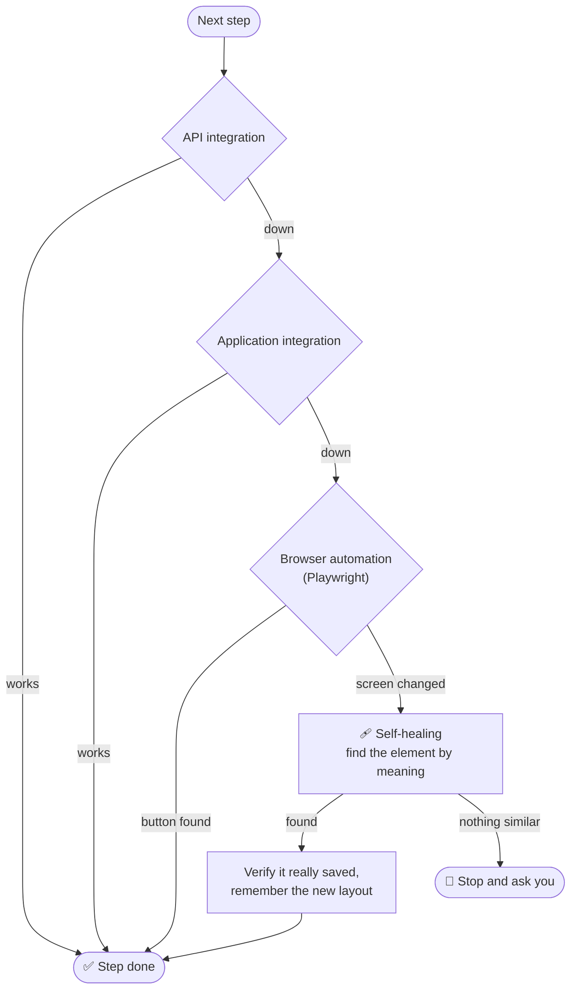

### 🩹 Self-healing in action

With the API **and** the integration switched off, and the CRM redesigned, the run still finishes. The redesign renamed **Save** to **Update record** and renamed every field. WorkFlowOS reports exactly what changed and remembers it for next time.

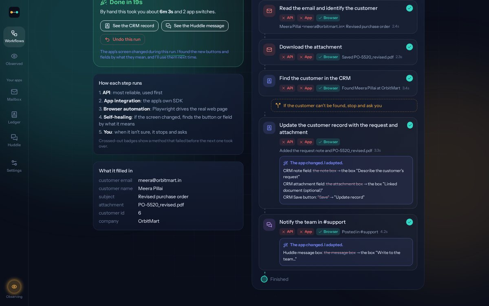

---

## 🛡️ Trust, safety and undo

Automation that changes customer records has to be trustworthy. WorkFlowOS treats autonomy as something that is **earned**, and can be lost.

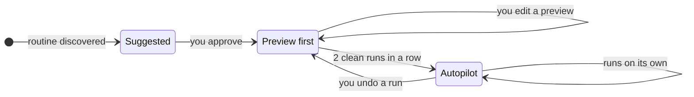

<table>
<tr>
<td width="50%" valign="top">

**Preview first**

A new workflow reads, downloads and finds the customer, then stops *before changing anything* and shows exactly what it will write. You can edit it.

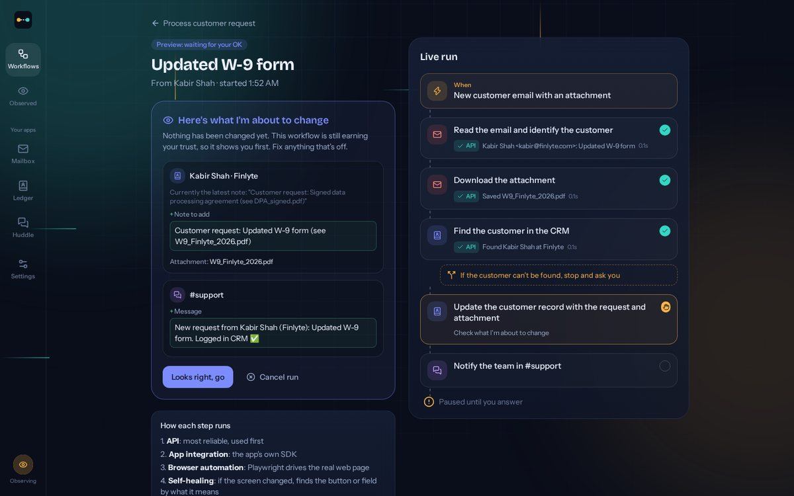

</td>
<td width="50%" valign="top">

**Stop and ask**

An unknown sender isn't guessed. It stops, suggests the likely company by email domain, and **remembers your answer** so next time it's automatic.

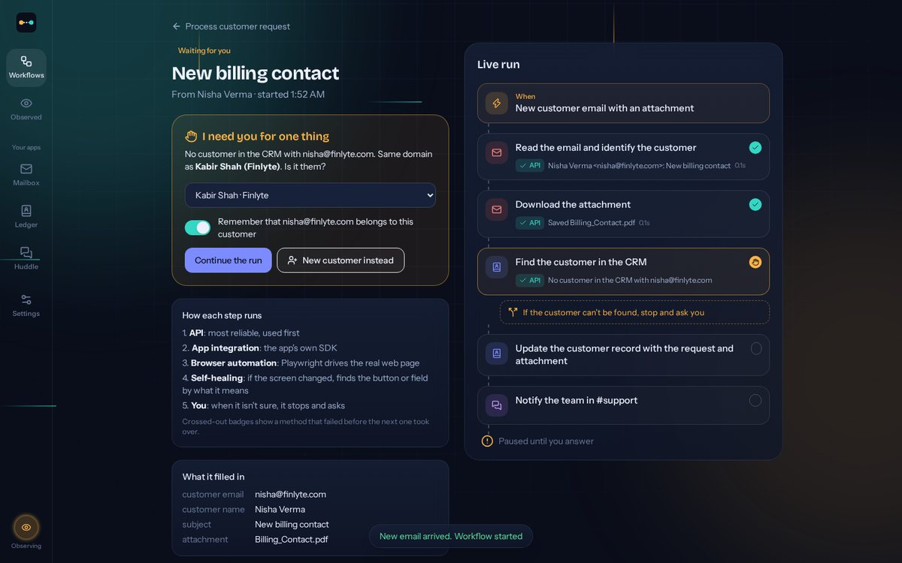

</td>
</tr>
</table>

**Undo:** every change a run makes is recorded with its reverse. One click removes the CRM note and the chat message (and posts a correction in Slack), then sends the workflow back to preview mode.

---

## 🗣️ Change it by saying it

Business rules change constantly. Type the change in plain English:

> *"Only notify #finance if the attachment is an invoice, and tag Priya"*

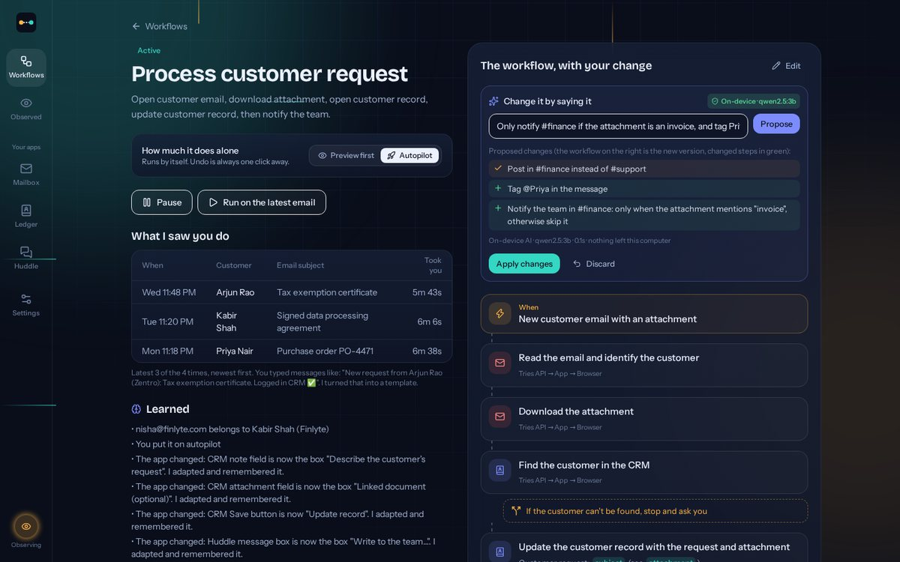

How it stays safe:

- A **local AI model** (qwen2.5 on Ollama) reads the sentence and proposes changes from a **fixed, small set** of operations: change channel, add a condition, tag someone, add or remove a step, change the wording.
- Every proposal is **checked against your actual words**. A channel, name or keyword you never said is thrown out.
- A built-in parser double-checks the AI and handles the common phrasings on its own, so it works even with no AI running.
- You see a **diff**, and nothing is saved until you click **Apply**.

The result: the invoice goes to #finance with Priya tagged, and a purchase order skips that step.

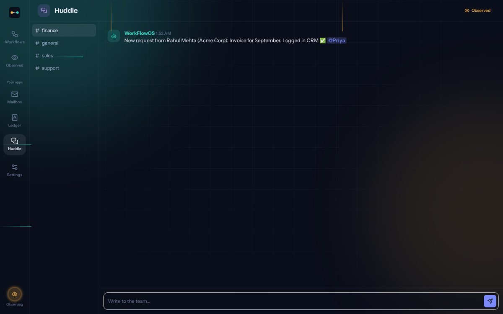

---

## 🏗️ Architecture

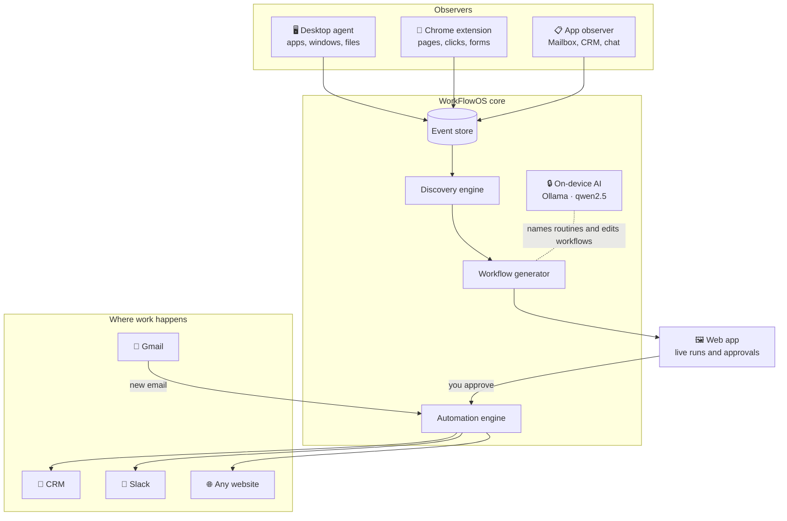

### Requirement by requirement

| Problem statement | How WorkFlowOS delivers it |
| :--- | :--- |
| **Desktop Activity Agent** | A lightweight desktop agent (app focus, window titles, saved files), a Chrome extension (navigation, clicks, form submits) and a built-in app observer, all producing one structured event format. |
| **Workflow Discovery Engine** | Session splitting, repeated-sequence mining with tolerance for detours, scoring by frequency, time spent, length and cross-app switches. |
| **AI Workflow Understanding** | Names the business intent, extracts variables (customer, company, subject, attachment) and learns message templates from what you typed. |
| **Workflow Generator** | A structured workflow with trigger, actions, conditions, variables and per-step integrations, plus the evidence behind it. |
| **User approval** | Nothing runs until you approve. Preview-first mode, earned autopilot, pause and dismiss. |
| **Automation Engine** | API → application integration → browser automation (Playwright) with semantic self-healing → ask the user. |
| **Learn** | Remembers your answers, adapts to UI changes, keeps your edits and tracks the time saved. |
| **Example scenario** | Email → download attachment → find customer → update CRM → notify team, with "customer not found → stop and ask", on real Gmail and Slack. |

---

## 🚀 Quick start

**You need:** Windows with Python 3.10 or newer. The web app is already built, so no Node is required.

1. Open the **workflowos** folder and double-click **run.bat**. The first run installs everything, which takes a few minutes.
2. Your browser opens **localhost:8765** by itself. Keep the black window open while you use the app.
3. Open **Settings → Reset demo data** for a clean start. A realistic week of activity is loaded, so a routine is already waiting to be discovered.

**Optional extras** (all in Settings):

| Extra | How to turn it on |
| :--- | :--- |
| 🔒 **On-device AI** | Install Ollama, then in Command Prompt type **ollama pull qwen2.5:3b**. WorkFlowOS finds it by itself. |
| 📧 **Real Gmail** | Settings → Real apps → your Gmail and a Google **App Password**. Only new emails with an attachment are imported, read-only. |
| 💬 **Real Slack** | Create an Incoming Webhook in your Slack workspace, then paste its URL in Settings → Real apps. |
| 🖥️ **Desktop agent** | Double-click **run_agent.bat**. Close its window to stop it. |
| 🧩 **Chrome extension** | Chrome → Extensions → Developer mode → Load unpacked → the **extension** folder. |

Everything works without the extras. The built-in Mailbox, Ledger CRM and Huddle chat make the full demo run offline.

---

## 🎬 Try the demo in 3 minutes

1. **Discovered:** Home shows *Process customer request*, repeated 4 times across 3 apps.
2. **Learns live:** do the routine once by hand in Mailbox → Ledger → Huddle, and the count becomes 5.
3. **Approve:** open the suggestion and click **Approve and automate**.
4. **Preview first:** **Send a test email**. It shows exactly what it will change. Click **Looks right, go**.
5. **Stop and ask:** the next email comes from an unknown sender. Confirm the company and it remembers.
6. **Autopilot:** after two clean runs, it offers autopilot.
7. **Break everything:** Settings → API down, integration down, CRM redesign. The run still completes and says *"The app changed. I adapted."*
8. **Undo:** one click rolls the run back.
9. **Say it:** *"Only notify #finance if the attachment is an invoice, and tag Priya."* Apply, send the invoice, and see it in #finance.

---

## 🔒 Privacy by design

- ❌ No keystrokes, no screenshots, no clipboard, ever
- 🙈 Password forms, banking and login pages, incognito tabs and sensitive window titles are skipped
- 📝 Form **values** are never recorded, only field names
- 💻 The AI runs locally, and **Local AI only** is on by default
- ⏸️ Observing can be paused at any time from Settings
- 🧾 The automation's own actions are never mistaken for yours

---

## 🧰 Built with

| Layer | Technology |
| :--- | :--- |
| Backend | FastAPI · SQLite · WebSockets |
| Frontend | React 18 · TypeScript · Vite · Tailwind CSS · Framer Motion |
| Automation | Playwright (browser automation and self-healing) · httpx |
| AI | Ollama with qwen2.5:3b, on-device · optional Groq cloud fallback, off by default |
| Real apps | Gmail over IMAP (App Password, read-only) · Slack Incoming Webhooks |
| Observers | Python desktop agent (no extra installs) · Chrome extension (Manifest V3) |
| Quality | 18 automated backend tests · full browser end-to-end runs of every demo path |

### What's inside

| Folder | Contents |
| :--- | :--- |
| **backend** | Discovery engine, workflow generator, automation engine, self-healing, natural-language editing, Gmail and Slack connectors, tests |
| **frontend** | The web app: home, observed activity, workflow pages, live run view, demo apps |
| **agent** | The desktop activity agent |
| **extension** | The Chrome extension |
| **docs** | Screenshots used in this README |

---

## 🗺️ What's next

- **Computer-vision fallback:** read the screen when a page offers no usable structure
- **Desktop app automation:** drive native apps through OS accessibility APIs, not just websites
- **More connectors:** Salesforce, HubSpot, Jira and Microsoft Teams, each as one adapter behind the same engine
- **Team sharing:** export discovered workflows so colleagues can reuse them

---

  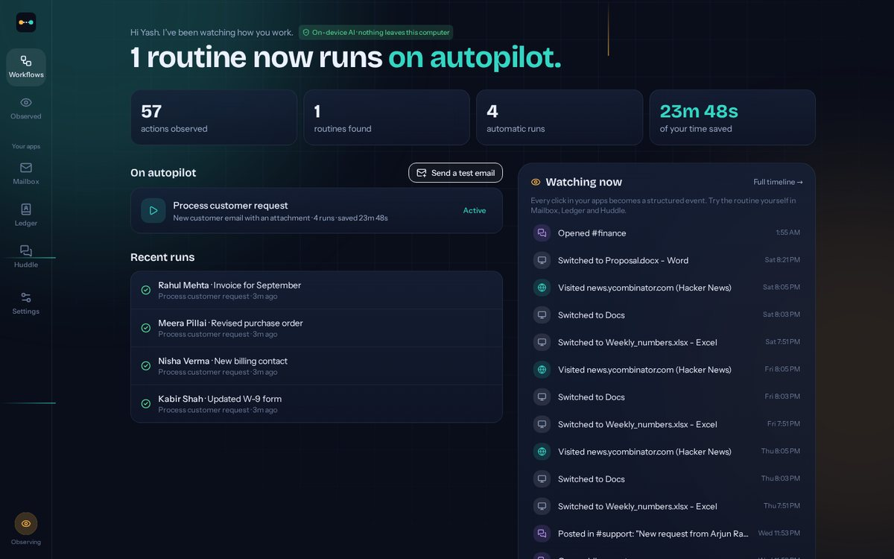

<b>WorkFlowOS: learns your work, earns your trust, heals itself, and can undo anything.</b>

Made with care by <b>Yash Jaiswal</b> · CMR Institute of Technology, Bengaluru

